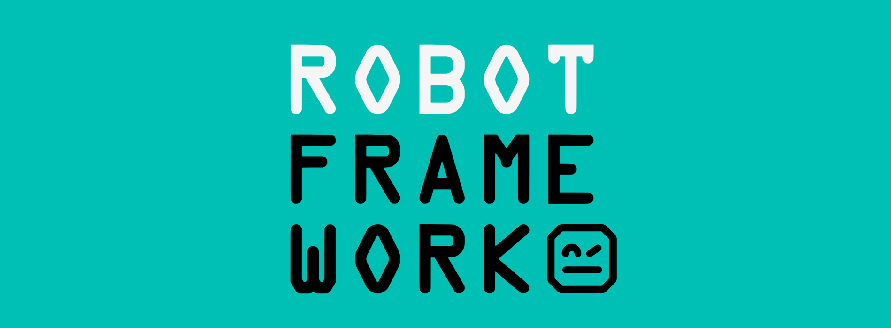

# Robot Framework

    

---

**Site oficial**: [https://robotframework.org/](https://robotframework.org/)

## O que é o Robot Framework?

O **Robot Framework** é um poderoso framework de automação de código aberto, utilizado para **automação de testes** e **automação de processos robóticos** (RPA). 

Desenvolvido e mantido pela **Robot Framework Foundation**, ele é amplamente adotado na indústria devido à sua flexibilidade e robustez. 

### Características principais:

- **Sintaxe simples e legível**: Utiliza uma sintaxe baseada em palavras-chave, tornando a automação acessível até para aqueles com pouca experiência em programação.
- **Extensibilidade**: Suporta a criação de bibliotecas adicionais em Python, Java e outras linguagens, permitindo expandir suas funcionalidades conforme necessário.
- **Integração fácil**: Pode ser integrado a outras ferramentas de automação, criando um ecossistema completo e flexível.
- **Comunidade ativa**: Com centenas de bibliotecas de terceiros disponíveis, o Robot Framework é suportado por uma comunidade ativa que contribui com melhorias constantes.

Além disso, o Robot Framework não possui custos de licenciamento, o que o torna uma opção acessível para empresas e desenvolvedores individuais.

## Próximo passo

Para começar a usar o Robot Framework, confira as instruções de instalação no link a seguir: [Instalação](./docs/install.md)
